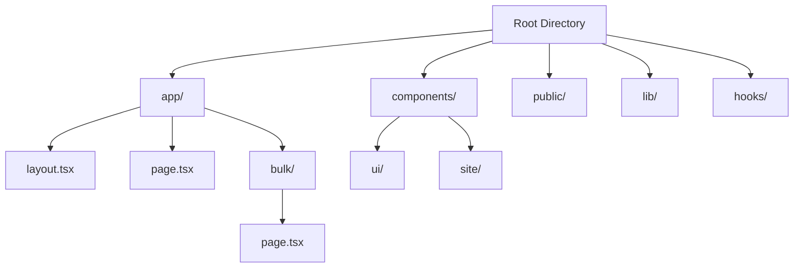

# Implementation Plan: Framework Upgrade to Next.js 16 with Turbopack

This document outlines the detailed plan to migrate the **Maison Noir — Wine Scroll Story** website from its current TanStack Start + Vite setup to the latest **Next.js 16 framework** using **Turbopack** for the bundler.

> [!IMPORTANT]
> This plan covers framework conversion (routing, layout, and configuration) without modifying the visual styling or core behavior of the UI components (e.g. scroll animations, calculators, or form logic).

---

## 1. Stack Comparison

| Component | Current Stack (TanStack Start) | Target Stack (Next.js 16) |
| :--- | :--- | :--- |
| **Framework** | TanStack Start (TS v5, React 19) | Next.js 16 (React 19) |
| **Bundler** | Vite / Nitro | Turbopack (`next dev --turbo`) |
| **Router** | TanStack Router (File-based) | Next.js App Router (File-based: `app/`) |
| **Styling** | Tailwind CSS v4.2.1 + `@tailwindcss/vite` | Tailwind CSS v4.2.1 + `@tailwindcss/postcss` or Next.js native CSS integration |
| **Data Fetching** | TanStack Query (`@tanstack/react-query`) | Next.js Server Components / React Server Components (RSC) + Client Hooks |

---

## 2. Directory & Structure Remapping

The project layout will change to align with standard Next.js directory guidelines:



### Route Mappings
* `src/routes/__root.tsx` &rarr; `app/layout.tsx` (Global HTML, Google Analytics, fonts, metadata, styles, and context providers)
* `src/routes/index.tsx` &rarr; `app/page.tsx` (Home page view container)
* `src/routes/bulk.tsx` &rarr; `app/bulk/page.tsx` (Bulk calculator and reservation page)
* `src/styles.css` &rarr; `app/globals.css` (Imported in global layout)

---

## 3. Detailed Upgrade Phase Steps

### Phase 1: Dependency Preparation
1. Uninstall TanStack Start, TanStack Router, Vite config plugin packages:
   ```bash
   bun remove @tanstack/react-router @tanstack/react-start @tanstack/router-plugin @lovable.dev/vite-tanstack-config @vitejs/plugin-react vite-tsconfig-paths nitro
   ```
2. Install Next.js 16, React 19, and matching peer dependencies:
   ```bash
   bun add next@16.0.0-canary.0 react@19.0.0 react-dom@19.0.0
   bun add -d @types/react@19.0.0 @types/react-dom@19.0.0
   ```
3. Update `package.json` scripts:
   ```json
   "scripts": {
     "dev": "next dev --turbo",
     "build": "next build",
     "start": "next start",
     "lint": "next lint"
   }
   ```

### Phase 2: Configuration Upgrade
1. **Next Configuration (`next.config.ts`)**:
   Create a standard Next.js config to enable the App Router and optimize features.
2. **PostCSS Config (`postcss.config.mjs`)**:
   Setup PostCSS to compile Tailwind CSS v4 if necessary, or configure Next.js Tailwind 4 plugin rules.
3. **TypeScript Configuration (`tsconfig.json`)**:
   Allow Next.js to auto-populate the framework-specific settings, incorporating the `.next/types` references.

### Phase 3: Layout and Provider Transition
1. **Providers Wrapper (`components/providers.tsx`)**:
   Encapsulate `@tanstack/react-query`'s `QueryClientProvider` and `Toaster` within a `"use client"` provider component to pass context down the App Router.
2. **Metadata Transfer**:
   Move metadata configurations from the static TanStack Router `head` declaration to Next.js's exportable `Metadata` objects in page level or global `layout.tsx`.
3. **Analytics Integration**:
   Use Next.js's `<Script>` component for optimized Google Tag Manager injection.

### Phase 4: Route Component Adaptation
1. Ensure interactive client components (e.g., `ScrollVideoHero`, `BulkCalculator`, `ContactSection`) are declared with `"use client"` at the top of the file since Next.js defaults components inside `app/` to Server Components.
2. Replace TanStack Router's `<Link>` component with Next.js's `next/link`.

---

## 4. Verification Plan

### Automated Checks
* **TypeScript compilation verification**:
  ```bash
  bun x tsc --noEmit
  ```
* **Production Build Compilation**:
  ```bash
  bun run build
  ```

### Manual Visual Tests
1. **Scroll Animations**: Verify scroll performance and section snap functionality under Turbopack dev server.
2. **Interactive Forms**: Validate that the Bulk Calculator and Contact forms work properly with validation/toaster alerts.
3. **Analytics verification**: Ensure the google tag manager loads correctly in the network log

--END--